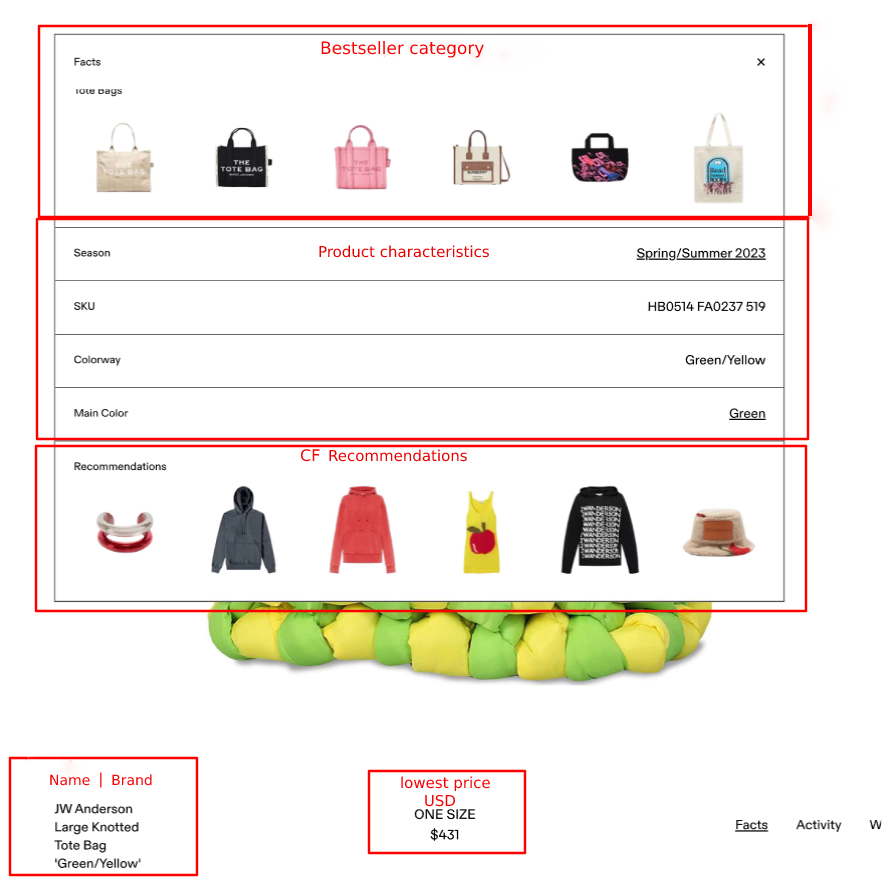

# Online Boutique stores: what factors drive product recommendations in limited-edition resale markets?

This repository accompanies my thesis that investigates product recommendations in the thriving fashion resale market. The platform uses product recommendations and recent 
product purchases from [GOAT](https://www.goat.com/), one of the biggest resale platforms in this industry. Because product recommendations are often said to present the 
most popular and revenue-generating items due to popularity bias, this is worth to be examined in this industry where rare and exclusive items play an important role for consumers shopping. The main constructs used in the study are product revenue an item attains through sales, and recommendation count (the number of times a product is recommended on the platform). 


# Repository overview
- The set up of the files in this project are as follows:
```
├── img
├── data
└──  gen
   ├── output
└── src
   ├── analysis
   ├── data-collection
   ├── data-preparation
├── paper
├── .gitignore
├── README.md
├── makefile

```

# Data 




## Dataset desription [(direct link to data)](https://drive.google.com/drive/u/0/folders/1HfVG22n4h4il92tmDk6Abf5qtocoBxyZ)

```
(1) recinfo_2023-05-02.csv
-Product recommendations(rec_id) per size and product condition (new, used, etc.)
-Relevant product info on brand, release date, color etc.
-The variable display_order refers to the ranking in one of the recommendation lists (each have up to 8 per product).
-For variables that have a display_order of 0, the product info refers to the product that was sampled and where the recommendations are shown(id).

(2) recent_purchases_2023-05-02.csv
-Recent purchases with timestamp for all recommendations in file 1.
-Location of sale included.

(3) productlist20230501.csv
-The top 10,000 products from GOAT's search [list](https://www.goat.com/search) for apparel and sneaker categories, with some product information such as retail price, last sold price.
-Product info here is not based on size per product.

(4) productlist20230425.csv
-Similar to file 3, with a wider selection outside the top 20,000 (100,000 + products)

(5) output_list_counts_all20230508.csv
- A short summary list of brands and the number of times they occur on the platform in total

* Note: file 3 and 4 are first used to draw a sample from in this analysis. File 1 and 2 are used directly in preparing the data and the analysis.
```


# Run study with the same data
If you want to replicate the study I did, it is suggested you run the same R files. This can be done easily if you have installed [make](https://gnuwin32.sourceforge.net/packages/make.htm). To set up make, this is a helpful [guide](https://tilburgsciencehub.com/building-blocks/configure-your-computer/automation-and-workflows/make/)

## Check dependencies first

First install the following packages for R:
```
install.packages("tidyverse")
install.packages("googledrive")
install.packages("anytime")
install.packages("stringr")
install.packages("lubridate")
install.packages("xtable")
install.packages("vtable")
install.packages("car")
install.packages("stargazer")
install.packages("broom")
```
To install and set up R this is a helpful [guide](https://tilburgsciencehub.com/building-blocks/configure-your-computer/statistics-and-computation/r/)

**If make and R are set up properly, you should be able to run the project in the following manner:**

- Clone the forked repository onto your local machine using the following command:
```
git clone https://github.com/<your-username>/Thesis-project-price-premiums.git
```
- In your local repository navigate to the base level of this repository
```
cd <yourpath/Thesis-project-price-premiums>
```
- Run make
```
make
```

# Gather new data
In case you want to gather the data from scratch, you can make use of the scrapers in the repository based on Python. The scrapers contact the API endpoints and either make direct requests or use a webdriver to obtain primarily product recommendations and  recent purchase data from GOAT. Unfortunately, not everything can be run in one scraper. The biggest reason is that during the project, more endpoints were needed to obtain more data. 

- Descriptions of each file:
```
(1) Goat_assortment_api.py
-Grabs the number of products per brand (quick summary only) (output corresponds to file 5 in dataset description)

(2) Goat_search_group_counts.py
-Obtains the product pages where the recommendations are found, or to collect items from top 10,000 products (output corresponds to file 3 & 4 in dataset description)

(3) Goat_sample.py
- (optional) is used to draw a sample from the collected product pages.

(4) Goat_recommendation_scraper.py
- Main scraper for recommendations (output corresponds to file 1 in dataset description)

(5) Goat_recent_purchases.py
- Collects recent purchases of recommended items (output corresponds to file 2 in dataset description)

```
- To arrive at the datasets as in the datafile, the scrapers should be run in the above order. When given the right input for a scraper (usually product ID) it is of course also possible to run them and use the outputs independently. 

*Note: For scraper 4 you need a key matching your browser sesssion. 

# Contact
s.bijl_1@tilburguniversity.edu
